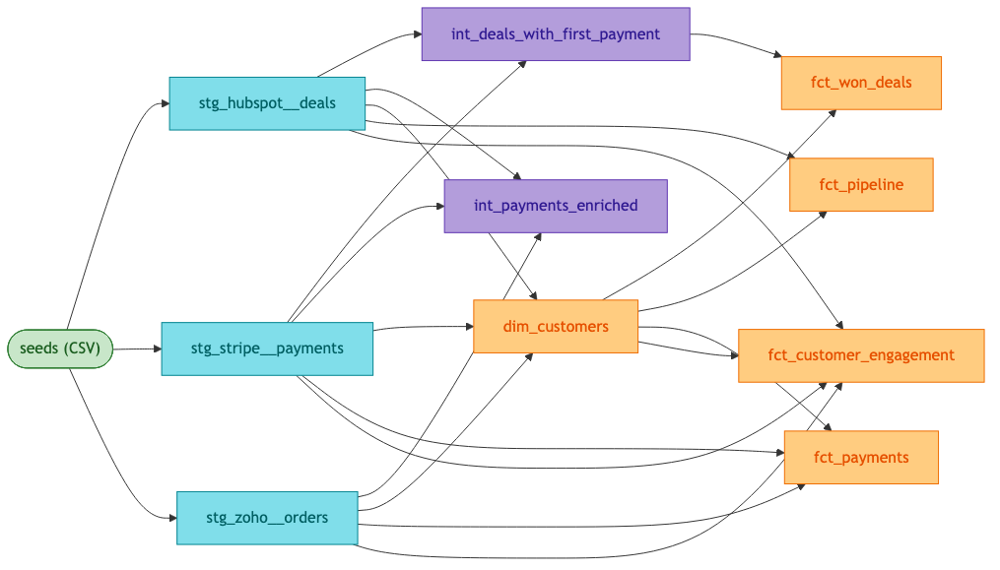
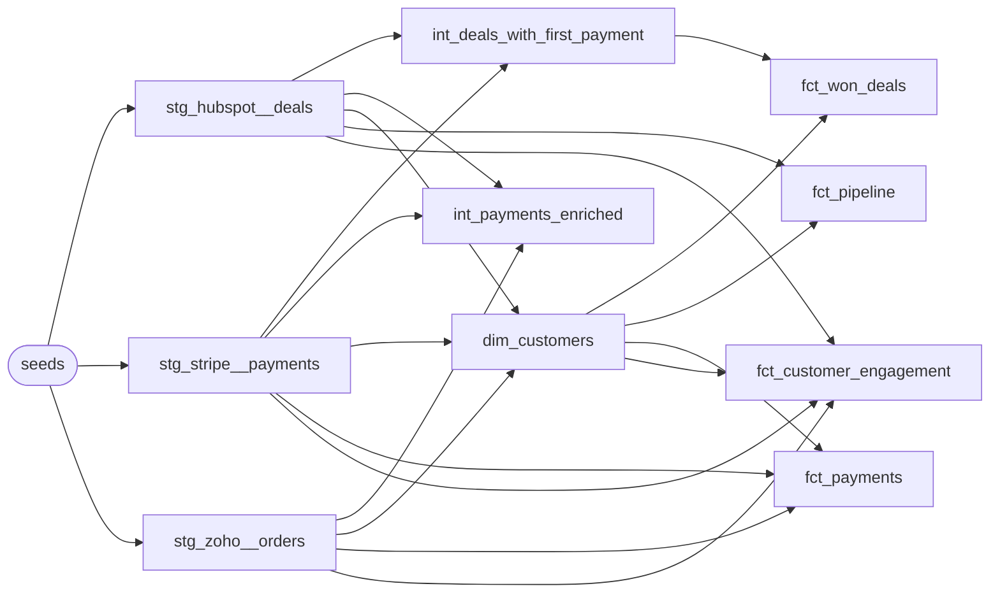

# dbt-saas-analytics

[](https://github.com/offloadmemory/dbt-saas-analytics/actions)

A small, self-contained dbt project that loads three CSV seeds (Hubspot deals, Stripe payments, Zoho orders) into a local DuckDB file, and transforms them through a standard **staging → intermediate → marts** layering. Marts are organized per business domain (sales, revenue, customer) and tagged accordingly.

The point of the project is to be a clean, runnable reference: real sources, real tests, real marts, full CI. Nothing more.

## Layout

```
dbt-saas-analytics/
├── pyproject.toml           # project metadata + poethepoet tasks
├── uv.lock                  # pinned dependency graph (commit this)
├── dbt_project.yml          # layer-level materialization rules
├── profiles.yml             # local DuckDB target
├── .sqlfluff                # sqlfluff config (duckdb dialect)
├── styleguide.md            # project conventions (fact vs. dim, layering, etc.)
├── seeds/                   # CSV inputs
│   ├── hubspot_deals.csv
│   ├── stripe_payments.csv
│   └── zoho_orders.csv
└── models/
    ├── staging/             # one view per source, typed + renamed
    │   ├── _sources.yml
    │   ├── hubspot/stg_hubspot__deals.sql
    │   ├── stripe/stg_stripe__payments.sql
    │   └── zoho/stg_zoho__orders.sql
    ├── intermediate/        # light joins / enrichments
    │   ├── int_payments_enriched.sql
    │   └── int_deals_with_first_payment.sql
    └── marts/               # tables for downstream consumers, grouped by domain
        ├── customer/        # dim_customers, fct_customer_engagement
        ├── revenue/         # fct_payments
        └── sales/           # fct_won_deals, fct_pipeline
```

## Data lineage



*The full lineage of all 10 models across 3 sources. Rendered from the source Mermaid definition in this README — same source, different output formats (PNG for GitHub preview, Mermaid for interactive viewers).*



## Prerequisites

- [uv](https://docs.astral.sh/uv/) (install with `curl -LsSf https://astral.sh/uv/install.sh | sh` or `brew install uv`).
- Python 3.10–3.12 (uv will provision this automatically if it's not already installed).
- A local DuckDB installation is **not** required — `dbt-duckdb` ships the engine.

## Install

```bash
uv sync
```

This creates a project-local `.venv` and installs the exact versions pinned in `uv.lock`.

## Run

All dbt workflows are wrapped in [poethepoet](https://poethepoet.natn.io/) tasks. Run them with `uv run poe <task>`:

```bash
# 1. Confirm dbt can find the profile and connect to DuckDB
uv run poe debug

# 2. Full local build: load seeds, then build all models
uv run poe build

# 3. Run schema tests (unique, not_null, accepted_values, ...)
uv run poe test

# 4. Build + test in one go
uv run poe all

# 5. Generate a 1000-row sample CSV via the standalone Faker script
uv run poe seed-sample
```

| Task          | What it does                                              |
| ------------- | --------------------------------------------------------- |
| `debug`       | `dbt debug` — profile + adapter connectivity.             |
| `build`       | `dbt seed` then `dbt run` (staging → intermediate → marts).|
| `test`        | `dbt test` — schema tests on all models.                  |
| `all`         | `build` then `test`.                                      |
| `seed-sample` | Run `seeder.py` to write `stripe_payments_sample.csv`.    |
| `docs`        | `dbt docs generate` — write the docs site to `target/`.   |

After `uv run poe build`, the local DuckDB file is at `./hello_dbt.duckdb` (override with the `DBT_DUCKDB_PATH` env var, which `profiles.yml` reads).

## Querying the output

Use the DuckDB CLI, or any tool that speaks the DuckDB driver:

```bash
duckdb hello_dbt.duckdb -c "select * from fct_won_deals"
duckdb hello_dbt.duckdb -c "select * from dim_customers order by total_deal_amount desc"
```

In DuckDB, dbt models are materialized into the schema named after the layer by default (e.g. `main_fct_won_deals`, `main_dim_customers` — schemas are configured by the project; see `dbt_project.yml` if you change this).

## Project management

This project uses [uv](https://docs.astral.sh/uv/) for dependency management and [poethepoet](https://poethepoet.natn.io/) for task running.

```bash
# Install / sync dependencies
uv sync

# Add a new dependency
uv add <package>

# Add a dev-only dependency
uv add --dev <package>

# Update the lockfile after editing pyproject.toml
uv lock

# Run any task
uv run poe <task>
```

The lockfile (`uv.lock`) is committed so installs are reproducible across machines and CI.

## Generating and viewing dbt docs

```bash
## Generating and viewing dbt docs

```bash
# Build the docs site (writes target/manifest.json, target/catalog.json, target/index.html)
uv run poe docs

# Serve the docs locally on http://localhost:8080
uv run dbt docs serve --port 8080
```

The lineage graph, model descriptions, column docs, and test coverage are all rendered in the browser.

### Hosted docs

The `docs-deploy` workflow builds the docs on every push to `main` and publishes them to GitHub Pages at:

**[https://offloadmemory.github.io/dbt-saas-analytics/](https://offloadmemory.github.io/dbt-saas-analytics/)**

The first deploy requires enabling Pages in the repo settings (Settings → Pages → Source: GitHub Actions). After that, every push to `main` rebuilds and redeploys the site.

## Layering rules

| Layer        | Materialization | Purpose                                                        |
| ------------ | --------------- | -------------------------------------------------------------- |
| staging      | view            | One model per source. Rename, type-cast, light cleaning only.  |
| intermediate | view            | Joins and enrichments across staging models. Reusable.         |
| marts        | table           | Final, business-facing fact and dimension tables.              |

Each folder has its own `_*__models.yml` with column descriptions and schema tests.

## Adding a new source

1. Drop the CSV in `seeds/`.
2. Add a `*__models.yml` next to the source name in `models/staging/_sources.yml`.
3. Create `models/staging/<source>/stg_<source>__<table>.sql` that selects from `{{ source('<source>', '<table>') }}` and renames/casts columns.
4. Add per-folder tests in `models/staging/<source>/_<source>__models.yml`.

## Resources

- [GitHub repo](https://github.com/offloadmemory/dbt-saas-analytics)
- [dbt documentation](https://docs.getdbt.com/)
- [dbt-duckdb adapter](https://github.com/duckdb/dbt-duckdb)
- [DuckDB](https://duckdb.org/)
- [uv](https://docs.astral.sh/uv/)
- [poethepoet](https://poethepoet.natn.io/)
